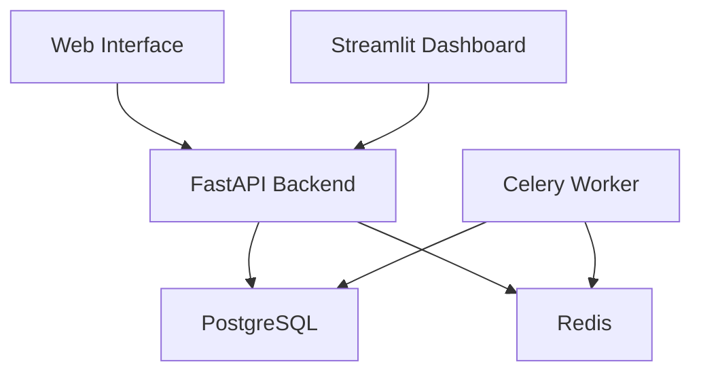

# 🔧 Ultimate AI Review Engine - Applications Guide

## Overview

This guide details all the applications that comprise the Ultimate AI Review Engine system, including setup instructions specific to Windows environments.

## Directory Structure
```
C:\Users\OLANREWAJU BDE\Desktop\ai-review-engine_updated\
├── api\                 # FastAPI backend service
├── web\                # Flask web interface
├── streamlit\          # Streamlit analytics dashboard
├── worker\             # Celery worker processes
├── scripts\            # Utility scripts
├── config\             # Configuration files
├── data\               # Data files
└── docs\               # Documentation
```

## Core Applications

### 1. FastAPI Backend Service 🚀
**Purpose**: Main API service handling data processing, search, and ML model inference

**Location**: `api/main.py`

**Setup**:
```powershell
# Navigate to API directory
cd C:\Users\OLANREWAJU BDE\Desktop\ai-review-engine_updated\api

# Install dependencies
pip install -r requirements.txt

# Start the API server
uvicorn main:app --host 0.0.0.0 --port 8000
```

**Key Features**:
- REST API endpoints for phone data
- Search functionality
- ML model inference
- User authentication
- Rate limiting

**Configuration** (`api/config.py`):
```python
API_CONFIG = {
    'HOST': '0.0.0.0',
    'PORT': 8000,
    'WORKERS': 4,
    'LOG_LEVEL': 'info',
    'CORS_ORIGINS': ['http://localhost:5000', 'http://localhost:8501']
}
```

### 2. Flask Web Interface 🌐
**Purpose**: Main user interface for regular users

**Location**: `web/app.py`

**Setup**:
```powershell
# Navigate to web directory
cd C:\Users\OLANREWAJU BDE\Desktop\ai-review-engine_updated\web

# Install dependencies
pip install -r requirements.txt

# Start the web server
python app.py
```

**Key Features**:
- User registration/login
- Basic search interface
- Account management
- Report generation

**Configuration** (`web/config.py`):
```python
WEB_CONFIG = {
    'SECRET_KEY': 'your-secret-key',
    'PORT': 5000,
    'DEBUG': True,
    'API_URL': 'http://localhost:8000'
}
```

### 3. Streamlit Analytics Dashboard 📊
**Purpose**: Advanced analytics and visualization interface

**Location**: `streamlit/dashboard.py`

**Setup**:
```powershell
# Navigate to Streamlit directory
cd C:\Users\OLANREWAJU BDE\Desktop\ai-review-engine_updated\streamlit

# Install dependencies
pip install -r requirements.txt

# Start Streamlit
streamlit run dashboard.py
```

**Key Features**:
- Interactive data visualizations
- Real-time analytics
- Custom report builder
- Export functionality

**Configuration** (`streamlit/config.toml`):
```toml
[server]
port = 8501
enableCORS = true

[theme]
primaryColor = "#FF4B4B"
backgroundColor = "#FFFFFF"
secondaryBackgroundColor = "#F0F2F6"
```

### 4. Celery Worker Service 🔄
**Purpose**: Background task processing

**Location**: `worker/tasks.py`

**Setup**:
```powershell
# Navigate to worker directory
cd C:\Users\OLANREWAJU BDE\Desktop\ai-review-engine_updated\worker

# Install dependencies
pip install -r requirements.txt

# Start Celery worker
celery -A tasks worker --loglevel=info -P eventlet
```

**Key Features**:
- Async data processing
- Report generation
- Email notifications
- Data cleanup tasks

**Configuration** (`worker/celeryconfig.py`):
```python
CELERY_CONFIG = {
    'broker_url': 'redis://localhost:6379/0',
    'result_backend': 'redis://localhost:6379/1',
    'task_serializer': 'json',
    'result_serializer': 'json',
    'accept_content': ['json']
}
```

### 5. Redis Server 📦
**Purpose**: Caching and message broker

**Windows Setup**:
```powershell
# Using chocolatey package manager
choco install redis-64

# Start Redis server
redis-server

# Test Redis
redis-cli ping
```

**Configuration** (`redis.windows.conf`):
```conf
port 6379
bind 127.0.0.1
maxmemory 512mb
maxmemory-policy allkeys-lru
```

### 6. PostgreSQL Database 💾
**Purpose**: Main data storage

**Windows Setup**:
```powershell
# Using chocolatey
choco install postgresql

# Start PostgreSQL service
net start postgresql-x64-15

# Create database
createdb ai_review_engine
```

**Configuration** (`postgresql.conf`):
```conf
listen_addresses = 'localhost'
port = 5432
max_connections = 100
shared_buffers = 128MB
```

## Utility Applications

### 1. Data Preparation Script
**Location**: `scripts/prepare_data.py`

**Usage**:
```powershell
python scripts/prepare_data.py
```

### 2. Model Training Script
**Location**: `scripts/train_models.py`

**Usage**:
```powershell
python scripts/train_models.py
```

### 3. Health Check Script
**Location**: `scripts/health_check.py`

**Usage**:
```powershell
python scripts/health_check.py
```

## Running All Services

### Option 1: Manual Start (Development)
Create a PowerShell script `start_services.ps1`:

```powershell
# Start all services
Start-Process pwsh -ArgumentList "-NoExit -Command `"cd $PSScriptRoot\api; uvicorn main:app --host 0.0.0.0 --port 8000`""
Start-Process pwsh -ArgumentList "-NoExit -Command `"cd $PSScriptRoot\web; python app.py`""
Start-Process pwsh -ArgumentList "-NoExit -Command `"cd $PSScriptRoot\streamlit; streamlit run dashboard.py`""
Start-Process pwsh -ArgumentList "-NoExit -Command `"cd $PSScriptRoot\worker; celery -A tasks worker --loglevel=info -P eventlet`""
```

### Option 2: Docker Compose (Recommended)
Using `docker-compose.yml`:

```powershell
# Start all services
docker-compose up -d

# View logs
docker-compose logs -f
```

## Application URLs

After starting all services, access the applications at:

- FastAPI Backend: http://localhost:8000
- API Documentation: http://localhost:8000/docs
- Web Interface: http://localhost:5000
- Analytics Dashboard: http://localhost:8501
- Celery Flower Monitor: http://localhost:5555

## Dependencies Between Applications



## Monitoring

### 1. Services Status
```powershell
# Check running services
Get-Service | Where-Object {$_.Name -like "*postgresql*" -or $_.Name -like "*redis*"}

# Check ports
netstat -ano | findstr "8000 5000 8501 5555 6379 5432"
```

### 2. Log Files
Default log locations:
```
C:\Users\OLANREWAJU BDE\Desktop\ai-review-engine_updated\
├── logs\
    ├── api.log
    ├── web.log
    ├── worker.log
    ├── streamlit.log
    └── error.log
```

## Troubleshooting Windows-Specific Issues

### 1. Port Conflicts
```powershell
# Find process using a port
netstat -ano | findstr "8000"

# Kill process
taskkill /PID <process_id> /F
```

### 2. Service Issues
```powershell
# Restart PostgreSQL
net stop postgresql-x64-15
net start postgresql-x64-15

# Restart Redis
net stop redis
net start redis
```

### 3. Permission Issues
```powershell
# Run as administrator
Start-Process pwsh -Verb RunAs
```

## Performance Optimization

### 1. Windows-Specific Settings
- Disable Windows Defender for project directory
- Configure Windows Firewall rules
- Optimize power settings for performance

### 2. Resource Allocation
```powershell
# Check system resources
Get-CimInstance Win32_ComputerSystem
Get-CimInstance Win32_OperatingSystem
```

---
📝 Documentation last updated: 2025-09-21