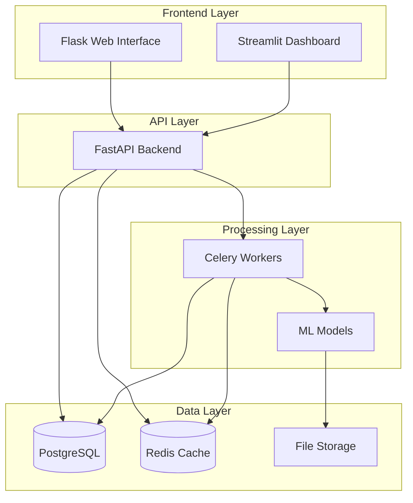
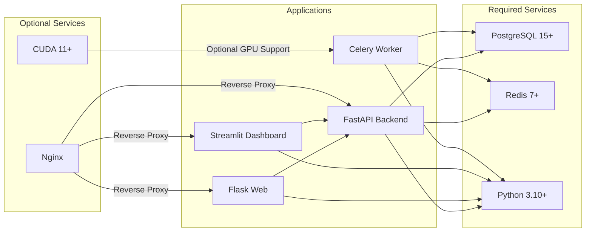
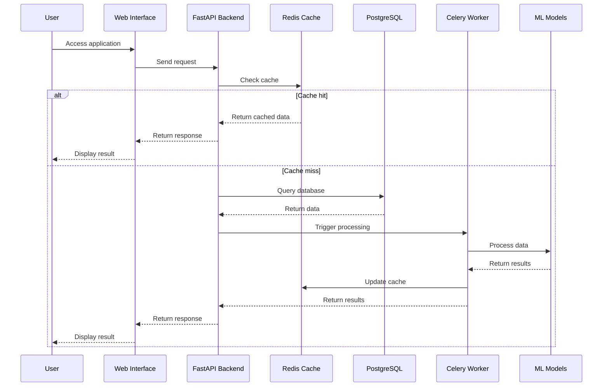
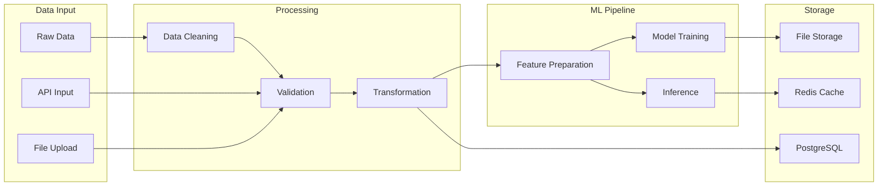
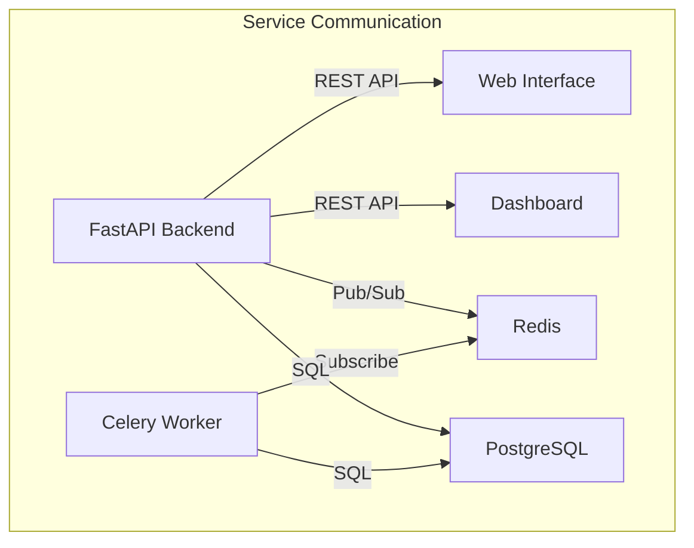
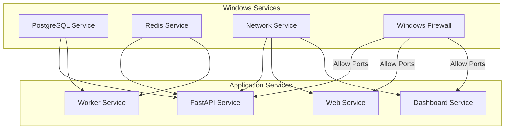

# 🏗️ Ultimate AI Review Engine - Architecture Guide

## Table of Contents
1. [System Architecture Overview](#1-system-architecture-overview)
2. [Component Dependencies](#2-component-dependencies)
3. [Data Flow](#3-data-flow)
4. [Component Details](#4-component-details)
5. [Integration Points](#5-integration-points)
6. [Resource Requirements](#6-resource-requirements)

## 1. System Architecture Overview

### 1.1. High-Level Architecture



### 1.2. Directory Structure
```
C:\Users\OLANREWAJU BDE\Desktop\ai-review-engine_updated\
├── api\                 # FastAPI Backend Service
│   ├── main.py         # API entrypoint
│   ├── models\         # Data models
│   ├── routes\         # API routes
│   └── services\       # Business logic
├── web\                # Flask Web Interface
│   ├── app.py         # Web app entrypoint
│   ├── templates\     # HTML templates
│   └── static\        # Static assets
├── streamlit\          # Analytics Dashboard
│   └── dashboard.py   # Dashboard application
├── worker\             # Celery Worker Service
│   ├── tasks.py       # Task definitions
│   └── celeryconfig.py # Celery configuration
├── ml\                 # Machine Learning Models
│   ├── sentiment\     # Sentiment analysis
│   └── recommender\   # Recommendation system
├── data\               # Data Storage
│   ├── processed\     # Processed datasets
│   └── raw\           # Raw data files
└── config\             # Configuration Files
    ├── prod\          # Production configs
    └── dev\           # Development configs
```

## 2. Component Dependencies

### 2.1. Service Dependencies



### 2.2. Python Package Dependencies

```plaintext
Core Dependencies:
├── fastapi==0.100.0         # API framework
├── flask==2.3.0             # Web framework
├── streamlit==1.25.0        # Dashboard framework
├── celery==5.3.0            # Task queue
├── redis==4.6.0             # Cache and message broker
├── sqlalchemy==2.0.0        # Database ORM
├── psycopg2-binary==2.9.0   # PostgreSQL adapter
├── pandas==2.0.0            # Data processing
├── numpy==1.24.0            # Numerical computations
└── pytorch==2.0.0           # Machine learning

Development Dependencies:
├── pytest==7.4.0            # Testing
├── black==23.3.0            # Code formatting
├── flake8==6.0.0            # Linting
├── mypy==1.4.0              # Type checking
└── docker-compose==2.20.0   # Container orchestration
```

## 3. Data Flow

### 3.1. Request Flow



### 3.2. Data Processing Pipeline



## 4. Component Details

### 4.1. FastAPI Backend (Port 8000)
- Main API service
- Handles authentication
- Manages data processing requests
- Coordinates with workers

**Dependencies**:
```plaintext
Required:
- PostgreSQL
- Redis
- Python 3.10+

Configuration:
api/config.py
```

### 4.2. Flask Web Interface (Port 5000)
- User interface
- Form processing
- Results display
- Session management

**Dependencies**:
```plaintext
Required:
- FastAPI Backend
- Redis (sessions)
- Python 3.10+

Configuration:
web/config.py
```

### 4.3. Streamlit Dashboard (Port 8501)
- Analytics visualization
- Real-time monitoring
- Report generation
- Interactive data exploration

**Dependencies**:
```plaintext
Required:
- FastAPI Backend
- Python 3.10+

Configuration:
streamlit/config.toml
```

### 4.4. Celery Worker
- Background processing
- ML model inference
- Data cleanup tasks
- Report generation

**Dependencies**:
```plaintext
Required:
- Redis
- PostgreSQL
- Python 3.10+
Optional:
- CUDA (GPU support)

Configuration:
worker/celeryconfig.py
```

## 5. Integration Points

### 5.1. API Endpoints

```plaintext
FastAPI Backend (8000):
├── /api/v1/auth/       # Authentication endpoints
├── /api/v1/search/     # Search functionality
├── /api/v1/analysis/   # Data analysis
└── /api/v1/admin/      # Administrative functions

Web Interface (5000):
├── /                   # Main interface
├── /dashboard/         # User dashboard
├── /reports/           # Report generation
└── /settings/         # User settings

Streamlit (8501):
└── /                   # Analytics dashboard
```

### 5.2. Service Communication



## 6. Resource Requirements

### 6.1. Minimum Requirements per Component

```plaintext
FastAPI Backend:
- CPU: 2 cores
- RAM: 2GB
- Storage: 5GB
- Network: 100Mbps

Flask Web:
- CPU: 1 core
- RAM: 1GB
- Storage: 2GB
- Network: 100Mbps

Streamlit Dashboard:
- CPU: 2 cores
- RAM: 2GB
- Storage: 2GB
- Network: 100Mbps

Celery Worker:
- CPU: 4 cores
- RAM: 4GB
- Storage: 10GB
- GPU: Optional

PostgreSQL:
- CPU: 4 cores
- RAM: 8GB
- Storage: 20GB
- Network: 1Gbps

Redis:
- CPU: 2 cores
- RAM: 4GB
- Storage: 10GB
- Network: 1Gbps
```

### 6.2. Windows-Specific Configuration

```powershell
# System settings optimization
# Create PowerShell script: optimize_system.ps1

# Memory management
Set-ItemProperty -Path "HKLM:\SYSTEM\CurrentControlSet\Control\Session Manager\Memory Management" `
    -Name "IoPageLockLimit" -Value 983040

# Network optimization
netsh interface tcp set global autotuninglevel=normal
netsh interface tcp set global chimney=enabled
netsh interface tcp set global rss=enabled

# Disk optimization
fsutil behavior set disabledeletenotify 0
fsutil behavior set encryptpagingfile 0

# Process priority
$processes = @{
    "uvicorn" = "High"
    "celery" = "AboveNormal"
    "redis" = "High"
    "postgres" = "High"
}

foreach ($process in $processes.Keys) {
    Get-Process $process | ForEach-Object { $_.PriorityClass = $processes[$process] }
}
```

## Windows Service Dependencies



## Port Configuration

```plaintext
Required Open Ports:
┌─────────────┬────────┬────────────────────────┐
│ Application │ Port   │ Purpose                │
├─────────────┼────────┼────────────────────────┤
│ Web UI      │ 5000   │ User Interface         │
│ API         │ 8000   │ Backend API            │
│ Dashboard   │ 8501   │ Analytics Interface    │
│ Celery      │ 5555   │ Task Monitoring        │
│ PostgreSQL  │ 5432   │ Database               │
│ Redis       │ 6379   │ Cache & Message Broker │
└─────────────┴────────┴────────────────────────┘
```

---
📝 Documentation last updated: 2025-09-21