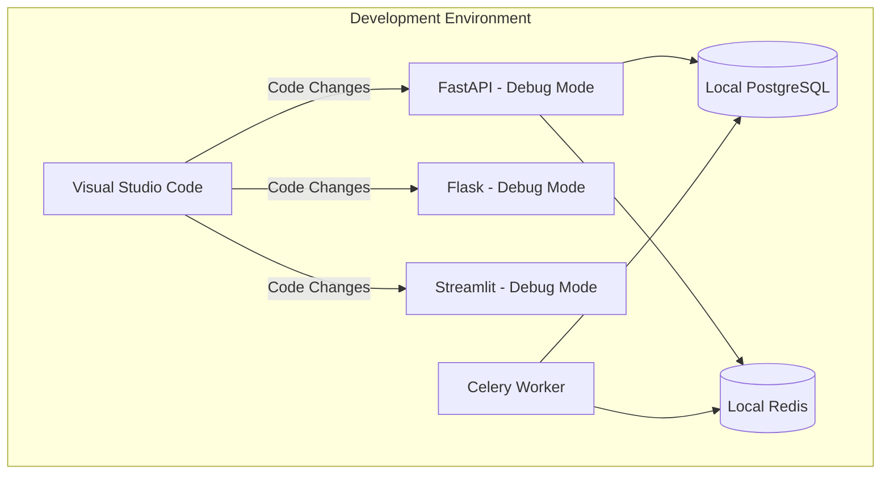
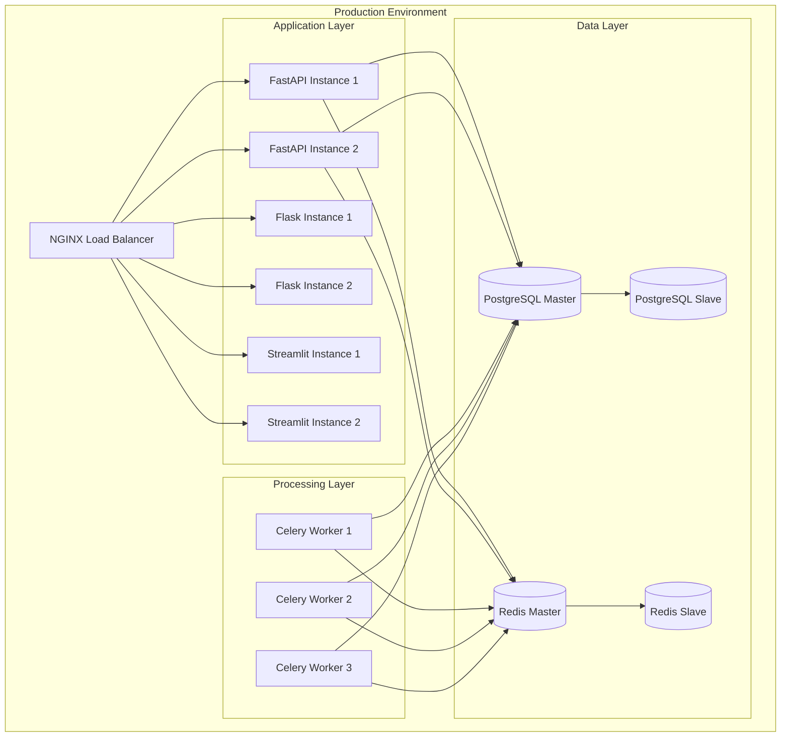
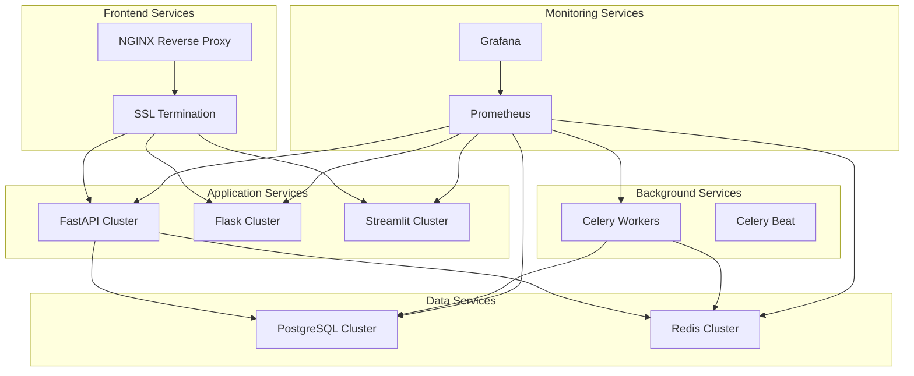
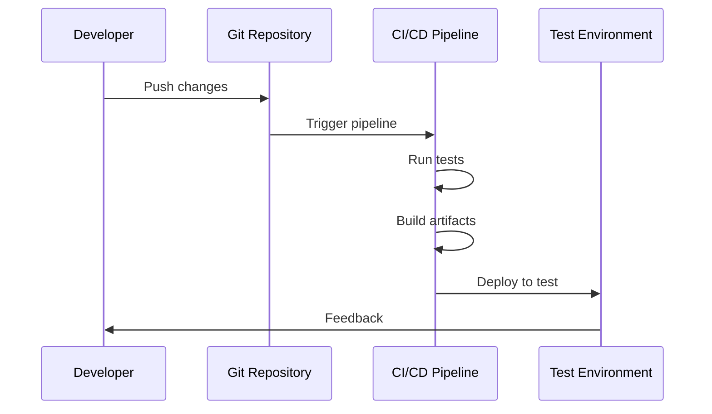
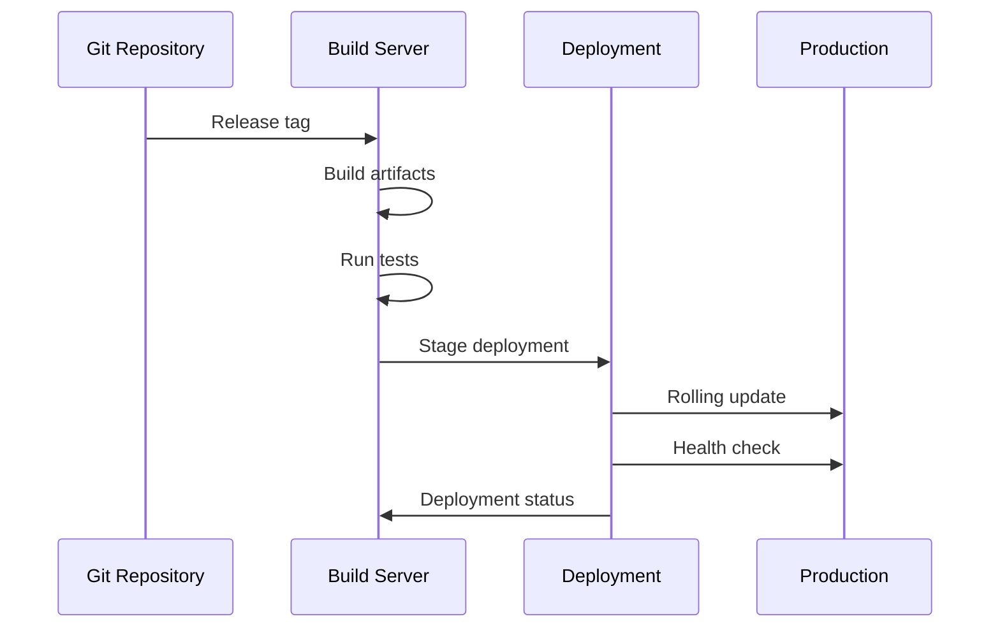
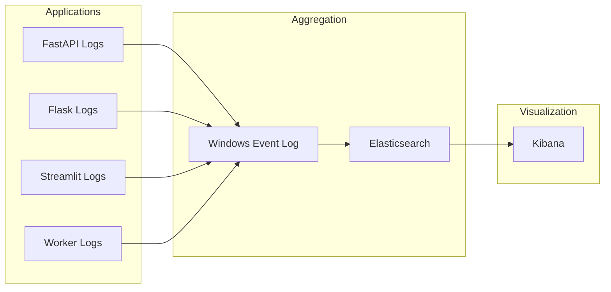
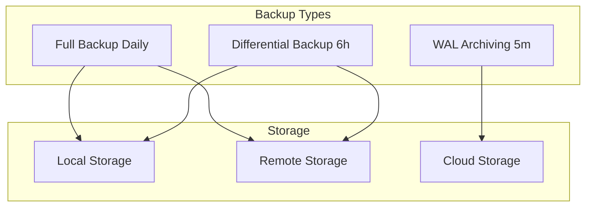
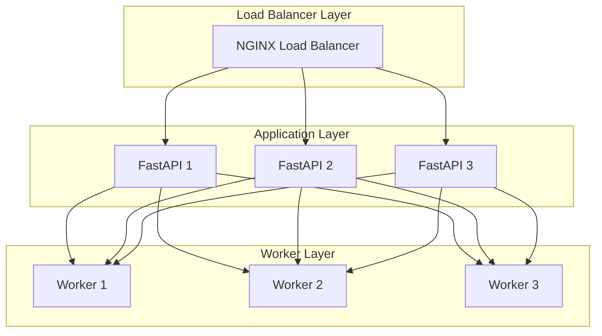

# 🚀 Ultimate AI Review Engine - Deployment Architecture

## Table of Contents
1. [Deployment Models](#1-deployment-models)
2. [Environment Setup](#2-environment-setup)
3. [Deployment Architecture](#3-deployment-architecture)
4. [Deployment Workflows](#4-deployment-workflows)
5. [Configuration Management](#5-configuration-management)
6. [Monitoring & Logging](#6-monitoring--logging)
7. [Backup & Recovery](#7-backup--recovery)
8. [Scaling Strategy](#8-scaling-strategy)

## 1. Deployment Models

### 1.1. Development Environment


### 1.2. Production Environment


## 2. Environment Setup

### 2.1. Local Development Setup
```powershell
# Create development environment
mkdir C:\Users\OLANREWAJU BDE\Desktop\ai-review-engine_updated
cd C:\Users\OLANREWAJU BDE\Desktop\ai-review-engine_updated

# Create virtual environment
python -m venv .venv
.\.venv\Scripts\Activate

# Install dependencies
pip install -r requirements-dev.txt
```

### 2.2. Production Setup
```powershell
# Production directory structure
C:\ai-review-engine\
├── apps\
│   ├── api\         # FastAPI application
│   ├── web\         # Flask application
│   └── dashboard\   # Streamlit application
├── services\
│   ├── nginx\       # NGINX configuration
│   ├── postgresql\  # PostgreSQL data
│   └── redis\       # Redis data
├── logs\            # Application logs
├── backups\         # Database backups
└── scripts\         # Deployment scripts
```

## 3. Deployment Architecture

### 3.1. Service Architecture


### 3.2. Windows Service Configuration

```powershell
# Service installation script (install_services.ps1)

# Install NSSM (Non-Sucking Service Manager)
choco install nssm -y

# FastAPI Service
nssm install AIReviewAPI "C:\ai-review-engine\.venv\Scripts\python.exe"
nssm set AIReviewAPI AppParameters "-m uvicorn api.main:app --host 0.0.0.0 --port 8000"
nssm set AIReviewAPI AppDirectory "C:\ai-review-engine\apps\api"
nssm set AIReviewAPI AppEnvironment "PATH=C:\ai-review-engine\.venv\Scripts;%PATH%"

# Flask Service
nssm install AIReviewWeb "C:\ai-review-engine\.venv\Scripts\python.exe"
nssm set AIReviewWeb AppParameters "web\app.py"
nssm set AIReviewWeb AppDirectory "C:\ai-review-engine\apps\web"

# Streamlit Service
nssm install AIReviewDashboard "C:\ai-review-engine\.venv\Scripts\streamlit.exe"
nssm set AIReviewDashboard AppParameters "run dashboard.py"
nssm set AIReviewDashboard AppDirectory "C:\ai-review-engine\apps\dashboard"

# Celery Workers
nssm install AIReviewWorker "C:\ai-review-engine\.venv\Scripts\celery.exe"
nssm set AIReviewWorker AppParameters "-A tasks worker --loglevel=info -P eventlet"
nssm set AIReviewWorker AppDirectory "C:\ai-review-engine\apps\worker"
```

## 4. Deployment Workflows

### 4.1. Development Deployment


### 4.2. Production Deployment


## 5. Configuration Management

### 5.1. Configuration Hierarchy
```plaintext
C:\ai-review-engine\
├── config\
│   ├── default.yml     # Default configuration
│   ├── development.yml # Development overrides
│   ├── staging.yml    # Staging overrides
│   └── production.yml # Production overrides
```

### 5.2. Environment-Specific Configuration
```yaml
# development.yml
environment: development
debug: true
database:
  host: localhost
  port: 5432
  name: ai_review_dev

# production.yml
environment: production
debug: false
database:
  host: prod-db.internal
  port: 5432
  name: ai_review_prod
```

## 6. Monitoring & Logging

### 6.1. Logging Architecture


### 6.2. Monitoring Setup
```powershell
# Install Prometheus Windows Exporter
choco install prometheus-windows-exporter -y

# Configure Prometheus
@"
global:
  scrape_interval: 15s

scrape_configs:
  - job_name: 'ai_review_engine'
    static_configs:
      - targets: ['localhost:8000', 'localhost:5000', 'localhost:8501']
"@ | Out-File -FilePath "C:\ai-review-engine\config\prometheus.yml"
```

## 7. Backup & Recovery

### 7.1. Backup Strategy


### 7.2. Recovery Procedures
```powershell
# Recovery script (recover_service.ps1)
param(
    [string]$Service,
    [string]$BackupPath
)

switch ($Service) {
    "database" {
        Stop-Service postgresql-x64-15
        pg_restore -d ai_review_engine $BackupPath
        Start-Service postgresql-x64-15
    }
    "redis" {
        Stop-Service redis
        Copy-Item $BackupPath "C:\Program Files\Redis\dump.rdb"
        Start-Service redis
    }
}
```

## 8. Scaling Strategy

### 8.1. Horizontal Scaling


### 8.2. Resource Scaling
```powershell
# Resource allocation script (scale_resources.ps1)
param(
    [string]$Component,
    [int]$Workers
)

$config = @{
    "api" = @{
        "min_workers" = 2
        "max_workers" = 10
    }
    "celery" = @{
        "min_workers" = 3
        "max_workers" = 15
    }
}

if ($Workers -le $config[$Component].max_workers) {
    # Scale component
    switch ($Component) {
        "api" {
            # Scale API instances
        }
        "celery" {
            # Scale Celery workers
        }
    }
}
```

## Deployment Checklist

```plaintext
Pre-Deployment:
□ Environment validation
□ Dependency check
□ Configuration verification
□ Database backup
□ Service health check

Deployment:
□ Stop application services
□ Deploy new code
□ Update configurations
□ Run database migrations
□ Start services in order
  1. PostgreSQL
  2. Redis
  3. FastAPI
  4. Celery Workers
  5. Flask Web
  6. Streamlit Dashboard

Post-Deployment:
□ Health check all services
□ Verify logs
□ Test critical paths
□ Monitor performance
□ Backup verification
```

---
📝 Documentation last updated: 2025-09-21