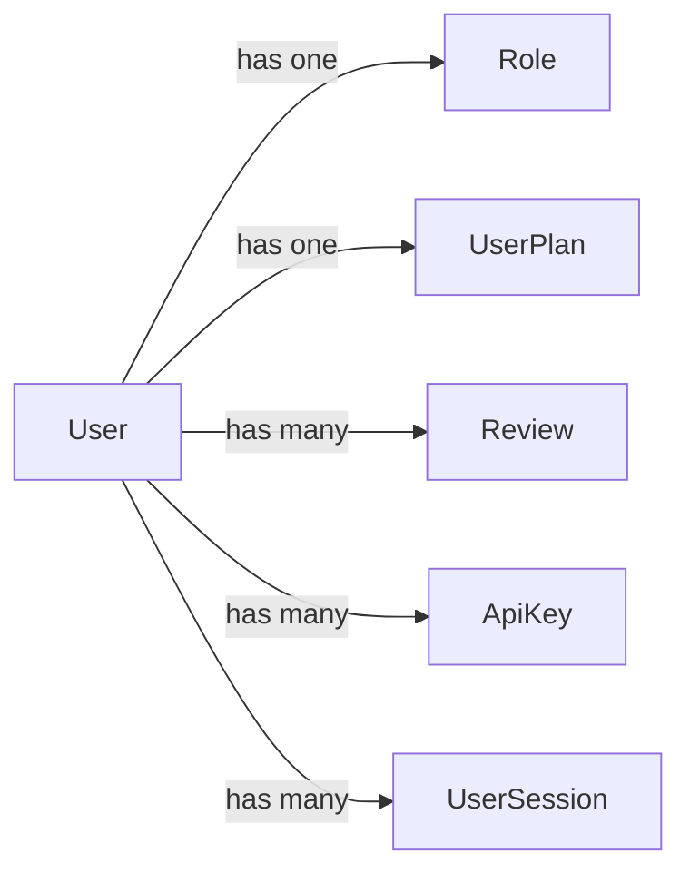
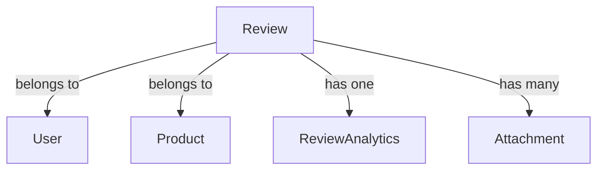

# 🔗 AI Review Engine - Database Relationships Documentation

## Overview

This document details the relationships between database tables in the AI Review Engine system.

## Core Relationships

### User Relationships



1. **User → Role** (Many-to-One)
   - Each user has exactly one role
   - Roles can be assigned to multiple users
   - Foreign key: `users.role_id → roles.id`
   ```sql
   ALTER TABLE users
   ADD CONSTRAINT fk_users_role
   FOREIGN KEY (role_id) REFERENCES roles(id);
   ```

2. **User → UserPlan** (Many-to-One)
   - Each user has one subscription plan
   - Plans can have multiple users
   - Foreign key: `users.plan_id → user_plans.id`
   ```sql
   ALTER TABLE users
   ADD CONSTRAINT fk_users_plan
   FOREIGN KEY (plan_id) REFERENCES user_plans(id);
   ```

3. **User → Review** (One-to-Many)
   - Users can create multiple reviews
   - Each review belongs to one user
   - Foreign key: `reviews.user_id → users.id`
   ```sql
   ALTER TABLE reviews
   ADD CONSTRAINT fk_reviews_user
   FOREIGN KEY (user_id) REFERENCES users(id)
   ON DELETE CASCADE;
   ```

### Review Relationships



1. **Review → ReviewAnalytics** (One-to-One)
   - Each review has one analytics record
   - Analytics are created after review processing
   - Foreign key: `review_analytics.review_id → reviews.id`
   ```sql
   ALTER TABLE review_analytics
   ADD CONSTRAINT fk_analytics_review
   FOREIGN KEY (review_id) REFERENCES reviews(id)
   ON DELETE CASCADE;
   ```

2. **Review → Product** (Many-to-One)
   - Each review is for one product
   - Products can have multiple reviews
   - Foreign key: `reviews.product_id → products.id`
   ```sql
   ALTER TABLE reviews
   ADD CONSTRAINT fk_reviews_product
   FOREIGN KEY (product_id) REFERENCES products(id);
   ```

## Relationship Properties

### Cascade Behavior

1. **User Deletion**
   - Deletes all associated reviews
   - Deletes all associated API keys
   - Deletes all associated sessions
   ```sql
   -- Example cascade delete
   DELETE FROM users WHERE id = '123';
   -- Automatically deletes related records in:
   -- - reviews
   -- - api_keys
   -- - user_sessions
   ```

2. **Review Deletion**
   - Deletes associated analytics
   - Deletes associated attachments
   ```sql
   -- Example cascade delete
   DELETE FROM reviews WHERE id = '456';
   -- Automatically deletes related records in:
   -- - review_analytics
   -- - attachments
   ```

### Indexing Strategy

1. **Foreign Key Indexes**
   ```sql
   -- User relationships
   CREATE INDEX idx_users_role_id ON users(role_id);
   CREATE INDEX idx_users_plan_id ON users(plan_id);
   
   -- Review relationships
   CREATE INDEX idx_reviews_user_id ON reviews(user_id);
   CREATE INDEX idx_reviews_product_id ON reviews(product_id);
   ```

2. **Compound Indexes**
   ```sql
   -- Reviews by user and date
   CREATE INDEX idx_reviews_user_date ON reviews(user_id, created_at);
   
   -- Reviews by product and rating
   CREATE INDEX idx_reviews_product_rating ON reviews(product_id, rating);
   ```

## Data Integrity

### Foreign Key Constraints

```sql
-- Example of complete constraint setup
ALTER TABLE reviews
    ADD CONSTRAINT fk_reviews_user
    FOREIGN KEY (user_id)
    REFERENCES users(id)
    ON DELETE CASCADE
    ON UPDATE CASCADE,
    ADD CONSTRAINT fk_reviews_product
    FOREIGN KEY (product_id)
    REFERENCES products(id)
    ON DELETE RESTRICT
    ON UPDATE CASCADE;
```

### Check Constraints

```sql
-- Rating constraints
ALTER TABLE reviews
    ADD CONSTRAINT check_rating_range
    CHECK (rating BETWEEN 1 AND 5);

-- Valid sentiment values
ALTER TABLE reviews
    ADD CONSTRAINT check_sentiment_values
    CHECK (sentiment IN ('positive', 'neutral', 'negative'));
```

## Query Patterns

### Common Join Patterns

1. **User Reviews with Analytics**
   ```sql
   SELECT r.*, ra.*
   FROM reviews r
   LEFT JOIN review_analytics ra ON r.id = ra.review_id
   WHERE r.user_id = :user_id
   ORDER BY r.created_at DESC;
   ```

2. **Product Reviews with User Info**
   ```sql
   SELECT r.*, u.username
   FROM reviews r
   JOIN users u ON r.user_id = u.id
   WHERE r.product_id = :product_id
   ORDER BY r.rating DESC;
   ```

### Performance Considerations

1. **Indexing for Common Queries**
   ```sql
   -- Optimize user review lookup
   CREATE INDEX idx_reviews_user_created
   ON reviews (user_id, created_at DESC);

   -- Optimize product rating lookup
   CREATE INDEX idx_reviews_product_rating
   ON reviews (product_id, rating DESC);
   ```

2. **Join Optimization**
   ```sql
   -- Use materialized view for common analytics
   CREATE MATERIALIZED VIEW review_summary AS
   SELECT 
       p.id as product_id,
       p.name as product_name,
       COUNT(r.id) as review_count,
       AVG(r.rating) as avg_rating,
       COUNT(CASE WHEN r.sentiment = 'positive' THEN 1 END) as positive_count
   FROM products p
   LEFT JOIN reviews r ON p.id = r.product_id
   GROUP BY p.id, p.name;
   ```

## Entity Lifecycle

### User Lifecycle

1. **Creation**
   ```sql
   -- Create user
   INSERT INTO users (username, email, password_hash)
   VALUES (:username, :email, :password_hash);
   
   -- Assign default role
   UPDATE users
   SET role_id = (SELECT id FROM roles WHERE name = 'user')
   WHERE id = :user_id;
   ```

2. **Deactivation**
   ```sql
   -- Soft delete user
   UPDATE users
   SET is_active = false,
       deactivated_at = CURRENT_TIMESTAMP
   WHERE id = :user_id;
   ```

### Review Lifecycle

1. **Creation and Processing**
   ```sql
   -- Create review
   INSERT INTO reviews (user_id, product_id, rating, content)
   VALUES (:user_id, :product_id, :rating, :content);
   
   -- Add analytics after processing
   INSERT INTO review_analytics (review_id, sentiment_scores)
   VALUES (:review_id, :sentiment_scores);
   ```

2. **Update and Reprocessing**
   ```sql
   -- Update review
   UPDATE reviews
   SET rating = :new_rating,
       content = :new_content,
       is_processed = false
   WHERE id = :review_id;
   
   -- Update analytics
   UPDATE review_analytics
   SET sentiment_scores = :new_scores,
       processed_at = CURRENT_TIMESTAMP
   WHERE review_id = :review_id;
   ```

## Best Practices

1. **Relationship Maintenance**
   - Regularly check for orphaned records
   - Verify referential integrity
   - Monitor index usage

2. **Performance Optimization**
   - Use appropriate cascade rules
   - Create targeted indexes
   - Monitor query performance

3. **Data Consistency**
   - Use transactions for related updates
   - Implement proper constraints
   - Validate data at the application level