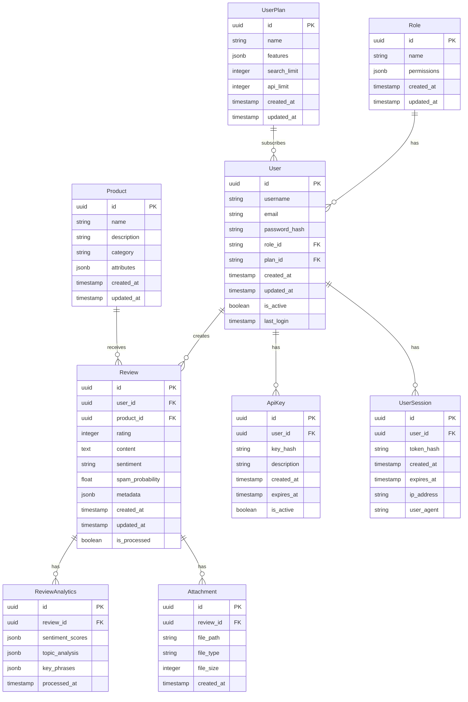

# 💾 AI Review Engine - Database Schema Documentation

## Overview

The AI Review Engine uses PostgreSQL as its primary database. This document describes the database schema, relationships, and migrations.

## Schema Diagram



## Table Descriptions

### Users Table
```sql
CREATE TABLE users (
    id UUID PRIMARY KEY DEFAULT gen_random_uuid(),
    username VARCHAR(50) NOT NULL UNIQUE,
    email VARCHAR(255) NOT NULL UNIQUE,
    password_hash VARCHAR(255) NOT NULL,
    role_id UUID REFERENCES roles(id),
    plan_id UUID REFERENCES user_plans(id),
    created_at TIMESTAMP WITH TIME ZONE DEFAULT CURRENT_TIMESTAMP,
    updated_at TIMESTAMP WITH TIME ZONE DEFAULT CURRENT_TIMESTAMP,
    is_active BOOLEAN DEFAULT true,
    last_login TIMESTAMP WITH TIME ZONE
);

CREATE INDEX idx_users_email ON users(email);
CREATE INDEX idx_users_username ON users(username);
```

The users table stores user account information, including authentication details and role assignments.

### Roles Table
```sql
CREATE TABLE roles (
    id UUID PRIMARY KEY DEFAULT gen_random_uuid(),
    name VARCHAR(50) NOT NULL UNIQUE,
    permissions JSONB NOT NULL DEFAULT '{}',
    created_at TIMESTAMP WITH TIME ZONE DEFAULT CURRENT_TIMESTAMP,
    updated_at TIMESTAMP WITH TIME ZONE DEFAULT CURRENT_TIMESTAMP
);

CREATE INDEX idx_roles_name ON roles(name);
```

The roles table defines user roles and their associated permissions.

### User Plans Table
```sql
CREATE TABLE user_plans (
    id UUID PRIMARY KEY DEFAULT gen_random_uuid(),
    name VARCHAR(50) NOT NULL UNIQUE,
    features JSONB NOT NULL DEFAULT '{}',
    search_limit INTEGER NOT NULL DEFAULT 100,
    api_limit INTEGER NOT NULL DEFAULT 1000,
    created_at TIMESTAMP WITH TIME ZONE DEFAULT CURRENT_TIMESTAMP,
    updated_at TIMESTAMP WITH TIME ZONE DEFAULT CURRENT_TIMESTAMP
);

CREATE INDEX idx_user_plans_name ON user_plans(name);
```

The user_plans table defines different subscription plans and their features.

### Reviews Table
```sql
CREATE TABLE reviews (
    id UUID PRIMARY KEY DEFAULT gen_random_uuid(),
    user_id UUID REFERENCES users(id) ON DELETE CASCADE,
    product_id UUID REFERENCES products(id),
    rating INTEGER NOT NULL CHECK (rating BETWEEN 1 AND 5),
    content TEXT NOT NULL,
    sentiment VARCHAR(20),
    spam_probability FLOAT,
    metadata JSONB DEFAULT '{}',
    created_at TIMESTAMP WITH TIME ZONE DEFAULT CURRENT_TIMESTAMP,
    updated_at TIMESTAMP WITH TIME ZONE DEFAULT CURRENT_TIMESTAMP,
    is_processed BOOLEAN DEFAULT false
);

CREATE INDEX idx_reviews_user_id ON reviews(user_id);
CREATE INDEX idx_reviews_product_id ON reviews(product_id);
CREATE INDEX idx_reviews_sentiment ON reviews(sentiment);
CREATE INDEX idx_reviews_created_at ON reviews(created_at);
```

The reviews table stores user reviews and their associated metadata.

### Review Analytics Table
```sql
CREATE TABLE review_analytics (
    id UUID PRIMARY KEY DEFAULT gen_random_uuid(),
    review_id UUID REFERENCES reviews(id) ON DELETE CASCADE,
    sentiment_scores JSONB NOT NULL DEFAULT '{}',
    topic_analysis JSONB NOT NULL DEFAULT '{}',
    key_phrases JSONB NOT NULL DEFAULT '[]',
    processed_at TIMESTAMP WITH TIME ZONE DEFAULT CURRENT_TIMESTAMP
);

CREATE INDEX idx_review_analytics_review_id ON review_analytics(review_id);
```

The review_analytics table stores detailed analysis of reviews.

### Products Table
```sql
CREATE TABLE products (
    id UUID PRIMARY KEY DEFAULT gen_random_uuid(),
    name VARCHAR(255) NOT NULL,
    description TEXT,
    category VARCHAR(100),
    attributes JSONB DEFAULT '{}',
    created_at TIMESTAMP WITH TIME ZONE DEFAULT CURRENT_TIMESTAMP,
    updated_at TIMESTAMP WITH TIME ZONE DEFAULT CURRENT_TIMESTAMP
);

CREATE INDEX idx_products_name ON products(name);
CREATE INDEX idx_products_category ON products(category);
```

The products table stores information about products being reviewed.

### API Keys Table
```sql
CREATE TABLE api_keys (
    id UUID PRIMARY KEY DEFAULT gen_random_uuid(),
    user_id UUID REFERENCES users(id) ON DELETE CASCADE,
    key_hash VARCHAR(255) NOT NULL,
    description VARCHAR(255),
    created_at TIMESTAMP WITH TIME ZONE DEFAULT CURRENT_TIMESTAMP,
    expires_at TIMESTAMP WITH TIME ZONE,
    is_active BOOLEAN DEFAULT true
);

CREATE INDEX idx_api_keys_user_id ON api_keys(user_id);
CREATE INDEX idx_api_keys_key_hash ON api_keys(key_hash);
```

The api_keys table stores API authentication keys for users.

### User Sessions Table
```sql
CREATE TABLE user_sessions (
    id UUID PRIMARY KEY DEFAULT gen_random_uuid(),
    user_id UUID REFERENCES users(id) ON DELETE CASCADE,
    token_hash VARCHAR(255) NOT NULL,
    created_at TIMESTAMP WITH TIME ZONE DEFAULT CURRENT_TIMESTAMP,
    expires_at TIMESTAMP WITH TIME ZONE NOT NULL,
    ip_address VARCHAR(45),
    user_agent VARCHAR(255)
);

CREATE INDEX idx_user_sessions_user_id ON user_sessions(user_id);
CREATE INDEX idx_user_sessions_token_hash ON user_sessions(token_hash);
CREATE INDEX idx_user_sessions_expires_at ON user_sessions(expires_at);
```

The user_sessions table tracks active user sessions.

### Attachments Table
```sql
CREATE TABLE attachments (
    id UUID PRIMARY KEY DEFAULT gen_random_uuid(),
    review_id UUID REFERENCES reviews(id) ON DELETE CASCADE,
    file_path VARCHAR(255) NOT NULL,
    file_type VARCHAR(50) NOT NULL,
    file_size INTEGER NOT NULL,
    created_at TIMESTAMP WITH TIME ZONE DEFAULT CURRENT_TIMESTAMP
);

CREATE INDEX idx_attachments_review_id ON attachments(review_id);
```

The attachments table stores files associated with reviews.

## Database Migrations

Migrations are managed using Alembic. Key migration files:

1. **Initial Migration (001_initial.py)**
   - Creates base tables (users, roles, products)
   - Sets up basic indexes
   - Adds default roles

2. **Review System (002_review_system.py)**
   - Adds reviews and review_analytics tables
   - Creates review-related indexes
   - Sets up triggers for analytics

3. **User Plans (003_user_plans.py)**
   - Adds user_plans table
   - Updates users table with plan_id
   - Migrates existing users to free plan

4. **API Authentication (004_api_auth.py)**
   - Adds api_keys table
   - Adds user_sessions table
   - Implements token hashing functions

5. **Attachments (005_attachments.py)**
   - Adds attachments table
   - Creates file storage functions
   - Sets up cleanup triggers

## Backup and Recovery

### Backup Script
```powershell
# backup_db.ps1
param(
    [string]$BackupDir = "C:\backups",
    [string]$DbName = "ai_review_engine"
)

$timestamp = Get-Date -Format "yyyyMMdd_HHmmss"
$backupPath = Join-Path $BackupDir "backup_${DbName}_${timestamp}.dump"

# Create backup
pg_dump -Fc -f $backupPath $DbName

# Compress backup
Compress-Archive -Path $backupPath -DestinationPath "${backupPath}.zip"
Remove-Item $backupPath

# Clean old backups (keep last 7 days)
Get-ChildItem $BackupDir -Filter "backup_${DbName}_*.zip" |
    Where-Object { $_.LastWriteTime -lt (Get-Date).AddDays(-7) } |
    Remove-Item
```

### Recovery Script
```powershell
# restore_db.ps1
param(
    [Parameter(Mandatory=$true)]
    [string]$BackupFile,
    [string]$DbName = "ai_review_engine"
)

# Drop existing connections
$query = "SELECT pg_terminate_backend(pid) FROM pg_stat_activity WHERE datname = '${DbName}' AND pid <> pg_backend_pid();"
psql -d postgres -c $query

# Drop and recreate database
dropdb $DbName
createdb $DbName

# Restore from backup
pg_restore -d $DbName $BackupFile
```

## Maintenance

### Database Optimization
```sql
-- Analyze tables for query optimization
ANALYZE users, reviews, products;

-- Update table statistics
VACUUM ANALYZE;

-- Reindex tables
REINDEX TABLE reviews;
REINDEX TABLE review_analytics;

-- Clean up expired sessions
DELETE FROM user_sessions WHERE expires_at < CURRENT_TIMESTAMP;

-- Archive old reviews
INSERT INTO reviews_archive
SELECT * FROM reviews
WHERE created_at < CURRENT_TIMESTAMP - INTERVAL '1 year';
```

### Monitoring Queries
```sql
-- Check table sizes
SELECT
    relname as table_name,
    pg_size_pretty(pg_total_relation_size(relid)) as total_size,
    pg_size_pretty(pg_relation_size(relid)) as table_size,
    pg_size_pretty(pg_total_relation_size(relid) - pg_relation_size(relid)) as index_size
FROM pg_catalog.pg_statio_user_tables
ORDER BY pg_total_relation_size(relid) DESC;

-- Check index usage
SELECT
    schemaname,
    tablename,
    indexname,
    idx_scan as times_used,
    idx_tup_read as tuples_read,
    idx_tup_fetch as tuples_fetched
FROM pg_stat_user_indexes
ORDER BY idx_scan DESC;

-- Find slow queries
SELECT
    query,
    calls,
    total_time,
    mean_time,
    rows
FROM pg_stat_statements
ORDER BY mean_time DESC
LIMIT 10;
```

## Security Considerations

1. **Data Encryption**
   - Passwords are hashed using Argon2
   - API keys are hashed using SHA-256
   - Sensitive data in JSONB fields is encrypted

2. **Access Control**
   - Row-Level Security (RLS) policies
   - Role-based access control
   - Object-level permissions

3. **Audit Logging**
   - All changes are logged
   - User actions are tracked
   - Security events are monitored

## Performance Optimization

1. **Indexing Strategy**
   - Compound indexes for common queries
   - Partial indexes for filtered queries
   - Expression indexes for computed values

2. **Partitioning**
   - Reviews table partitioned by date
   - Analytics table partitioned by review_id
   - Archival strategy for old data

3. **Caching**
   - Materialized views for analytics
   - Redis cache for frequent queries
   - Query result caching

## Best Practices

1. **Data Integrity**
   - Use constraints for data validation
   - Implement triggers for data consistency
   - Regular data quality checks

2. **Query Optimization**
   - Use prepared statements
   - Implement connection pooling
   - Regular EXPLAIN ANALYZE

3. **Maintenance**
   - Regular VACUUM and ANALYZE
   - Index maintenance
   - Statistics updates